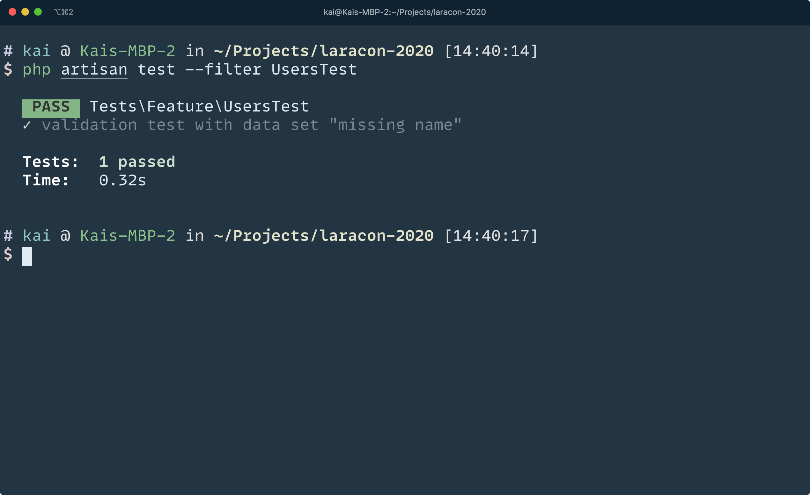
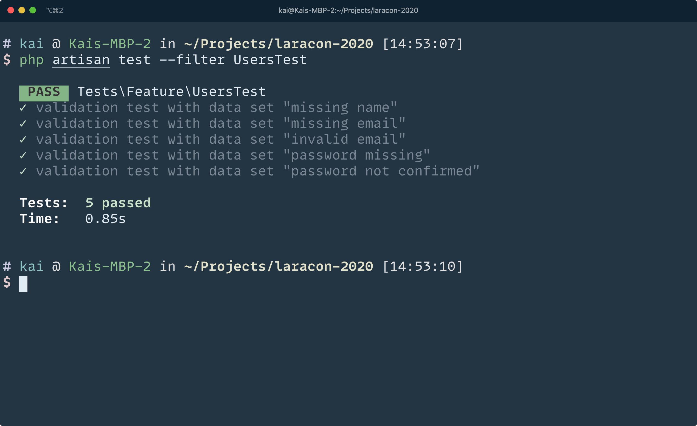
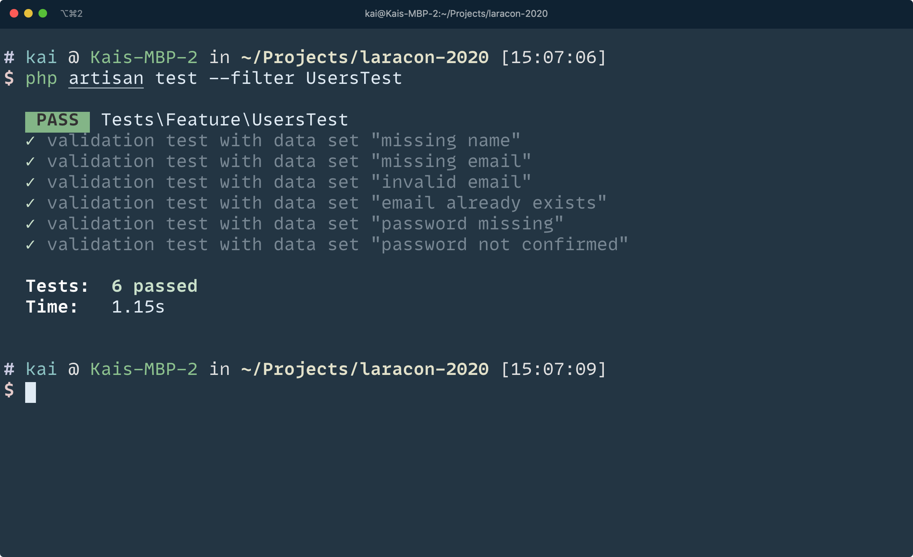

build-lists: true
theme: Simple
[.footer: Laracon EU 2020]

# _Better Testing_ in Laravel

#### Kai Sassnowski // @warsh33p // kai-sassnowski.com

---

[.footer: The Goal: _Properties of Tests_]

## The _Goal_

### i.e. What _properties_ do I want my tests to have?

---

[.footer: The Goal: _Properties of Tests_]

## The Goal: Properties of Tests

- ~~Prove correctness~~
- Allow me to refactor
  - How confident am I in my test suite?
- Serve as excecutable documentation
- Simple to understand

---

[.footer: The Goal: _Properties of Tests_]

## [fit] What about _fast_?

---

### **Tip** #1

## [fit] spatie/**phpunit-watcher**

---

[.footer: Tip #1: spatie/_phpunit-watcher_]


## Run entire test suite on save

```bash
phpunit-watcher watch
```

---

[.footer: Tip #1: spatie/_phpunit-watcher_]


## Run subset of tests on save

```bash
phpunit-watcher watch --filter=DependencyGraph
```

---

[.footer: Tip #1: spatie/_phpunit-watcher_]

## Using it with Pest

```yaml
# .phpunit-watcher.yml
phpunit:
  binaryPath: vendor/bin/pest
```

---

### **Tip** #2

## [fit] Reducing <br> **unnecessary details**

---

[.footer: Tip #2: Reducing _unnecessary_ details]
[.code-highlight: all]
[.code-highlight: 4]
[.code-highlight: 6-10]
[.code-highlight: 7,9]
[.code-highlight: 12-17]
[.code-highlight: 14,16]
[.code-highlight: all]

```php
/** @test */
public function creatingANewGame(): void
{
    $user = User::factory()->create();

    $this->actingAs($user)->post(route('games.store'), [
        'name' => 'My super cool game',
        'is_public' => 1,
        'description' => 'A really long description that no one will ever read.',
    ]);

    $this->assertDatabaseHas('games', [
        'user_id' => $user->id,
        'name' => 'My super cool game',
        'is_public' => 1,
        'description' => 'A really long description that no one will ever read.',
    ]);
}
```

---

[.footer: Tip #2: Reducing _unnecessary_ details]
[.code-highlight: 1-7]
[.code-highlight: 4]
[.code-highlight: 6]
[.code-highlight: 1-7]
[.code-highlight: 9-15]
[.code-highlight: 12]
[.code-highlight: 14]
[.code-highlight: 9-15]

```php
/** @test */
public function canBeConstructedWithAValidSerialNumber(): void
{
    $serialNumber = SerialNumber::fromString('ABCDEFG10234');

    $this->assertEquals('ABCDEFG10234', (string) $serialNumber);
}

/** @test */
public function throwsAnExceptionIfSerialNumberIsInvalid(): void
{
    $this->expectException(InvalidArgumentException::class);

    SerialNumber::fromString('9999999999');
}
```

---

### **Tip** #3

## [fit] Testing **Validation**

---

[.footer: Tip #3: _Testing Validation_]
[.code-highlight: all]
[.code-highlight: 5-8]

```php
class UsersController extends Controller
{
    public function store(Request $request): RedirectResponse
    {
        $this->validate([
            'name' => 'required',
            'email' => ['required', 'email', 'unique:users,email'],
            'password' => ['required', 'confirmed'],
        ]);

        // Good to go, create the user...
    }
}
```

---

[.footer: Tip #3: _Testing Validation_]
[.code-highlight: all]
[.code-highlight: 5-7]
[.code-highlight: 10]

```php
/** @test */
public function name_is_required()
{
    $response = $this->post(route('users.store'), [
        'email' => 'foo@bar.com',
        'password' => '::password::',
        'password_confirmation' => '::password::',
    ]);

    $response->assertSessionHasErrors('name');
}
```

---

[.footer: Tip #3: _Testing Validation_]

```php
/** @test */
public function name_is_required() { /* ... */ }

/** @test */
public function email_is_required() { /* ... */ }

/** @test */
public function email_must_be_valid() { /* ... */ }

/** @test */
public function email_must_be_unique() { /* ... */ }

/** @test */
public function password_is_required() { /* ... */ }

/** @test */
public function password_has_to_be_confirmed() { /* ... */ }
```

---

[.footer: Tip #3: _Testing Validation_]

## **Data providers** to the rescue

---

[.footer: Tip #3: _Testing Validation_]
[.code-highlight: all]
[.code-highlight: 3]
[.code-highlight: 5]
[.code-highlight: 7-9]

```php
/**
 * @test
 * @dataProvider validationProvider
 */
public function validationTests(array $payload, string $key)
{
    $response = $this->post(route('users.store'), $payload));

    $response->assertSessionHasErrors($key);
}
```

---

[.footer: Tip #3: _Testing Validation_]
[.code-highlight: all]
[.code-highlight: 1]
[.code-highlight: 3-8]
[.code-highlight: 10-15]
[.code-highlight: 11-14]
[.code-highlight: 12]
[.code-highlight: 13]
[.code-highlight: all]

```php
public function validationProvider(): Generator
{
    $defaultPayload = [
        'name' => '::name::',
        'email' => 'valid@example.com',
        'password' => '::password::',
        'password_confirmation' => '::password::',
    ];

    yield from [
        'missing name' => [
            'payload' => Arr::except($defaultPayload, 'name'),
            'key' => 'name',
        ],
    ];
}
```

---

[.footer: Tip #3: _Testing Validation_]



---

[.footer: Tip #3: _Testing Validation_]

> “Ok, missing fields are easy. What about **incorrect values**?”
> — You, probably

---

[.footer: Tip #3: _Testing Validation_]
[.code-highlight: all]
[.code-highlight: 4,5]

```php
$defaultPayload = [
    'name' => '::name::',
    'email' => 'valid@example.com',
    'password' => '::password::',
    'password_confirmation' => '::password::',
];
```

---

[.footer: Tip #3: _Testing Validation_]
[.code-highlight: 4-5]

```php
$defaultPayload = [
    'name' => '::name::',
    'email' => 'valid@example.com',
    'password' => '::password::',
    'password_confirmation' => '::incorrect-confirmation::',
];
```

---

[.footer: Tip #3: _Testing Validation_]
[.code-highlight: all]
[.code-highlight: 8-10]
[.code-highlight: 12-17]
[.code-highlight: all]

```php
$defaultPayload = [
    'name' => '::name::',
    'email' => 'valid@example.com',
    'password' => '::password::',
    'password_confirmation' => '::password::',
];

array_merge($defaultPayload, [
    'password_confirmation' => '::incorrect-confirmation::',
]),

// => [
//     'name' => '::name::',
//     'email' => 'valid@example.com',
//     'password' => '::password::',
//     'password_confirmation' => '::incorrect-confirmation::',
// ]

```

---

[.footer: Tip #3: _Testing Validation_]
[.code-highlight: 4-9]
[.code-highlight: 5-7]

```php
yield from [
    // Other data sets...

    'password not confirmed' => [
        'payload' => array_merge($defaultPayload, [
            'password_confirmation' => '::incorrect-confirmation::',
        ]),
        'key' => 'password',
    ],
]
```

---

[.footer: Tip #3: _Testing Validation_]



---

[.footer: Tip #3: _Testing Validation_]

> “What about **unique emails**?”
> — You, again

---

[.footer: Tip #3: _Testing Validation_]
[.code-highlight: all]
[.code-highlight: 4-6]
[.code-highlight: 10-11]
[.code-highlight: all]

```php
/** @test */
public function email_must_be_unique()
{
    User::factory()->create([
        'email' => 'test@example.com',
    ]);

    $response = $this->post(route('users.store'), [
        'name' => '::name::',
        // Same as the user above
        'email' => 'test@example.com',
        'password' => '::password::',
        'password_confirmation' => '::password::',
    ]);

    $response->assertSessionHasErrors('email');
}
```

---

[.footer: Tip #3: _Testing Validation_]

## We a need a **setup** step

---

[.footer: Tip #3: _Testing Validation_]
[.code-highlight: all]
[.code-highlight: 5]
[.code-highlight: 7-9]
[.code-highlight: all]

```php
/**
 * @test
 * @dataProvider validationProvider
 */
public function validationTests(array $payload, string $key, callable $setup = null)
{
    if ($setup !== null) {
        $setup();
    }

    $response = $this->post(route('users.store'), $payload));

    $response->assertSessionHasErrors($key);
}
```

---

[.footer: Tip #3: _Testing Validation_]
[.code-highlight: all]
[.code-highlight: 8-17]
[.code-highlight: 9-10]
[.code-highlight: 11-15]
[.code-highlight: 12-14]

```php
public function validationProvider(): Generator
{
    $defaultPayload = [/* ... */];

    yield from [
        // other data sets here...

        'email already exists' => [
            'payload' => $defaultPayload,
            'key' => 'email',
            'setup' => function () use ($defaultPayload) {
                User::factory()->create([
                    'email' => $defaultPayload['email']
                ]);
            },
        ]
    ]
}
```

---

[.footer: Tip #3: _Testing Validation_]



---

### **Tip** #4

## [fit] Testing **Middleware**

---

[.footer: Tip #4: _Testing Middleware_]

Todo: Quick summary of what middleware does

---

[.footer: Tip #4: _Testing Middleware_]

```php
class AdminMiddleware
{
    public function handle(Request $request, Closure $next)
    {
        // Fancy PHP 8 nullsafe operator
        if (! $request->user()?->is_admin) {
            abort(403);
        }

        return $next($request);
    }
}
```

---

[.footer: Tip #4: _Testing Middleware_]

## [fit] What's the _problem_?

### Isn't a middleware _just a function_?

---

[.footer: Tip #4: _Testing Middleware_]

## Middleware

```php
public function handle(Request $request, Closure $next);
```

---

[.footer: Tip #4: _Testing Middleware_]

## **Problem 1**: The `Request` class

---

[.footer: Tip #4: _Testing Middleware_]

### **Problem 1**: The `Request class`

[.column]

```php
public function __construct(
    array $query = [],
    array $request = [],
    array $attributes = [],
    array $cookies = [],
    array $files = [],
    array $server = [],
    $content = null
) {
    // ...
}
```

[.column]

- Complicated to construct
- Detracts from the actual test
- Makes the test harder to read
- Reduced confidence

---
