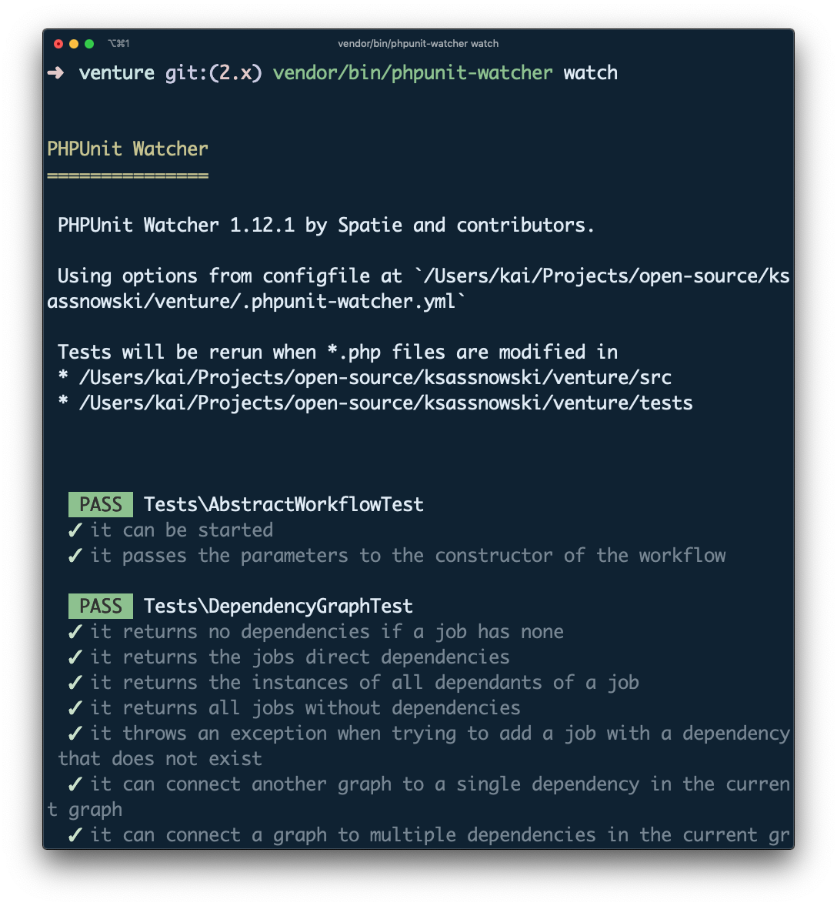
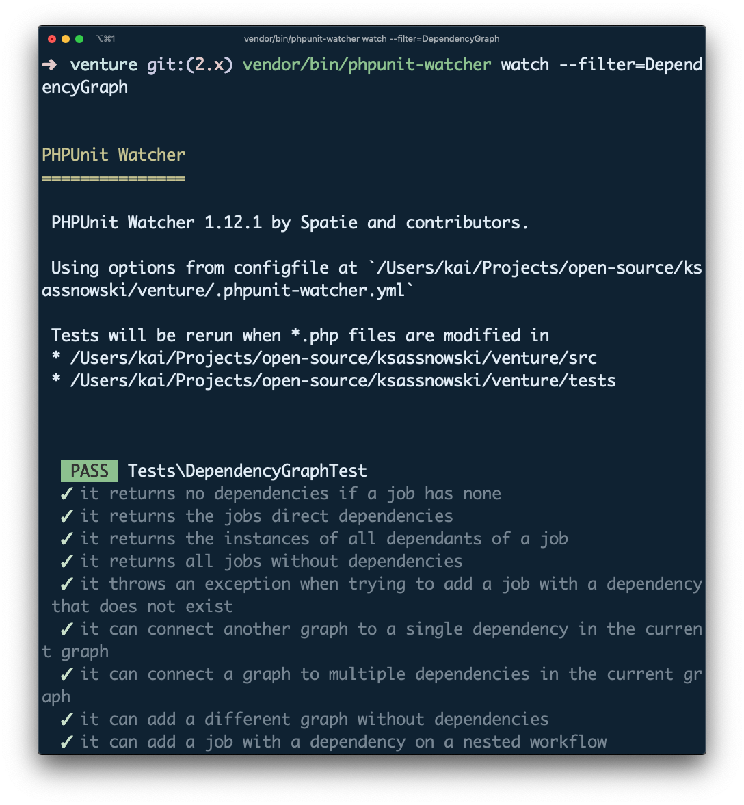

build-lists: true
[.footer: Laracon EU 2020]

# _Better Testing_ in Laravel

#### Kai Sassnowski // @warsh33p // kai-sassnowski.com

---

[.footer: The Goal: _Properties of Tests_]

## The _Goal_

### i.e. What _properties_ do I want my tests to have?

---

[.footer: The Goal: _Properties of Tests_]

## The Goal: Properties of Tests

- ~~Prove correctness~~
- Allow me to refactor
  - How confident am I in my test suite?
- Serve as excecutable documentation
- Simple to understand

---

[.footer: The Goal: _Properties of Tests_]

## [fit] What about _fast_?

---

### _Tip_ #1

## spatie/_phpunit-watcher_

---

[.footer: Tip #1: spatie/_phpunit-watcher_]



## Run entire test suite on save

```bash
phpunit-watcher watch
```

---

[.footer: Tip #1: spatie/_phpunit-watcher_]



## Run subset of tests on save

```bash
phpunit-watcher watch --filter=DependencyGraph
```

---

[.footer: Tip #1: spatie/_phpunit-watcher_]

## Using it with Pest

```yaml
# .phpunit-watcher.yml
phpunit:
  binaryPath: vendor/bin/pest
```

---

### _Tip_ #2

## Reducing _unnecessary_ details

---

[.footer: Tip #2: Reducing _unnecessary_ details]
[.code-highlight: all]
[.code-highlight: 4]
[.code-highlight: 6-10]
[.code-highlight: 7,9]
[.code-highlight: 12-17]
[.code-highlight: 14,16]
[.code-highlight: all]

```php
/** @test */
public function creatingANewGame(): void
{
    $user = User::factory()->create();

    $this->actingAs($user)->post(route('games.store'), [
        'name' => 'My super cool game',
        'is_public' => 1,
        'description' => 'A really long description that no one will ever read.',
    ]);

    $this->assertDatabaseHas('games', [
        'user_id' => $user->id,
        'name' => 'My super cool game',
        'is_public' => 1,
        'description' => 'A really long description that no one will ever read.',
    ]);
}
```

---

[.footer: Tip #2: Reducing _unnecessary_ details]
[.code-highlight: 1-7]
[.code-highlight: 4]
[.code-highlight: 6]
[.code-highlight: 1-7]
[.code-highlight: 9-15]
[.code-highlight: 12]
[.code-highlight: 14]
[.code-highlight: 9-15]

```php
/** @test */
public function canBeConstructedWithAValidSerialNumber(): void
{
    $serialNumber = SerialNumber::fromString('ABCDEFG10234');

    $this->assertEquals('ABCDEFG10234', (string) $serialNumber);
}

/** @test */
public function throwsAnExceptionIfSerialNumberIsInvalid(): void
{
    $this->expectException(InvalidArgumentException::class);

    SerialNumber::fromString('9999999999');
}
```

---

### Tip #?

## Testing _Middleware_

---

[.footer: Tip #3: _Testing Middleware_]

## [fit] What's the _problem_?

### Isn't a middleware _just a function_?

---

[.footer: Tip #3: _Testing Middleware_]

## Middleware

```php
public function handle(Request $request, Closure $next);
```

---

```php
class AdminMiddleware
{
    public function handle(Request $request, Closure $next)
    {
        // Fancy PHP 8 nullsafe operator
        if (! $request->user()?->is_admin) {
            abort(403);
        }

        return $next($request);
    }
}
```

---

---
